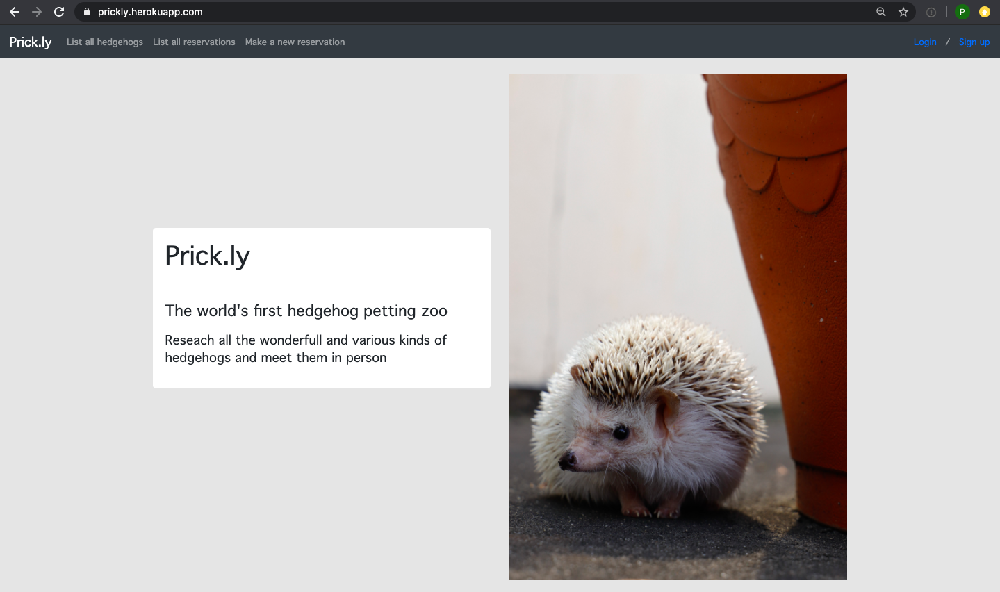
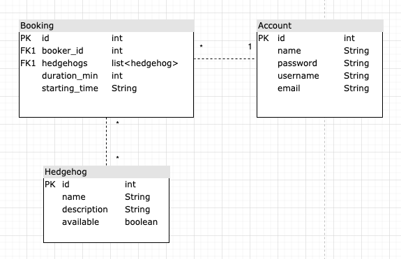

# Prick.ly - Hedgehog Petting Zoo
Project for Database application course in Helsinki University. See the live project [here](https://prickly.herokuapp.com/).

To log in to the service create your own credentials or use the following:\
username:<b> sonic</b>\
password:<b> hedgehog</b>

To log in to the service as admin use the following:\
username:<b> admin</b>\
password:<b> hogmaster</b>

## Project description
Prick.ly is the world’s first hedgehog petting zoo. Hedgehog lovers may log into the service to reseach the wonderfull various kind of hedgehogs they would like to meet in person. User that is logged in may book a meeting time with one or more hedgehogs at the same time - given that the hedgehogs are available and not on holiday or booked by some other keen hogger. Prick.ly service administratives can add new hedgehogs to the service and make sure that the status of every hedgehog is correct.



## Service functionalities and user guide
With Prick.ly it is possible to
- Sign up and login to the service
- Find hedhogs by their various qualities (name, breed, age etc.)
- Book one or more hedgehogs for a meetup
- Add more hedgehogs to the database (for admins)
- Set a status of a hedgehog as "unavailable" (for admins)
- Delete a hedgehog from the database (for admins)

To see the updated user stories documentation, visit [here](documentation/userstories.md).
### User guide
All the main functionalities of this app are found in the top navigation bar: <b>"list all hedgehogs"</b>, <b>"list all reservations"</b> and <b>"make a new reservation"</b>.

All users, whether they are logged in or not, may go and see the listing of hedgehogs. For all the rest of the functionalities user must log in to the service - button can be found at the right corner of the site. If user has yet no credentials then they may sign in also from the right corner of the page.

From reservation listing, an authenticated user sees all the reservations they have made with the hedgehogs. By clicking the "See attending hedgehogs" they can view the hedgehogs they have reserved and also add more hedgehogs to their reservation.

Making a new reservation happens in two phases: 
- first user picks the date they want to meet hedgehogs and also tells how long session they want. 
- Next the service shows all the hedgehogs that are available.

Currently to make sure all hedgehogs get their daily rest, hedgehogs have only one meeting a day and user can pick only one hedgehog for their session when reserving the time. After making the reservation they may book more hedgehogs to meet from their reservation summary at "list all reservations".

## Intallation instructions
In order to install and run this program in your local machine you need to install Python 3.5 or newer version. Check you version with ```python3 --version``` or ```python --version``` and download a newer release if needed -  for example with ```brew install python3``` or from [here](https://www.python.org/downloads/).

In addition you need PostGresSQL database management system to install the psycopg2 adapter. Follow instructions [here](https://postgresapp.com/)

After this you are ready for the installation steps:

1. Clone this repository to your local machine
2. Create a virtual environment inside the repository with ```python3 -m venv venv```
3. Launch the environment with ```source venv/bin/activate``` (and then upgrade you pip with ```pip install --upgrade pip```)
4. Inside the repository do ```pip install -r requirements.txt```
5. You're all set! Launch the application with ```python3 run.py``` - it opens at http://127.0.0.1:5000/

If you want to launch the service in Heroku inside repository do ```heroku create``` and then ```git push heroku master```. Open the app with ```heroku open```. See the Procfile for further details about the deployment services in use.

## Database description
Below is a picture about the database plan for the Prick.ly service. More detailed SQL queries are documented with the [user stories](documentation/userstories.md).



## Further development ideas
As with every project that has limited amount of resources and time not all the ideas get implemented. Here are few suggestions with no specific order:
- The booking happens on a date level - this could be more specific by adding a time to the reservation. On the same go more validation of what time (during regular business hours) one may reserve their hedgehog.
- As of now, the user can only add more hedgehogs to their reserved time. However, removing hedgehogs from reservation could concidered as well. Now the solution is to delete the reservation and create it with correct hedgehog
- When admin needs to remove a hedgehog from the service it would be appropriate to notify all the users that have a booking with the specific hedgehog. This would be done by generating a list of users with the reservations in the future and extend the database with more user specific contact information such as email or phone numbers
- There is a "verified" column in the database in the reservation table. This could be taken into use to notify users about their bookings or pushing them to for example read the safety instructions and guidance before their reserved event
- One might say that one of the most important selection criteria for a visitor of a hedgehog petting zoo is the looks of a hedgehog. Pictures would definitely bring more visual aspect and appeal to the application and help users to compare hedgehogs and learn about their characteristics. This could be done by setting up a separate hedgehog picture server and linking the images there to the service.

